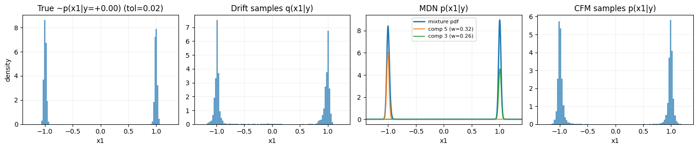
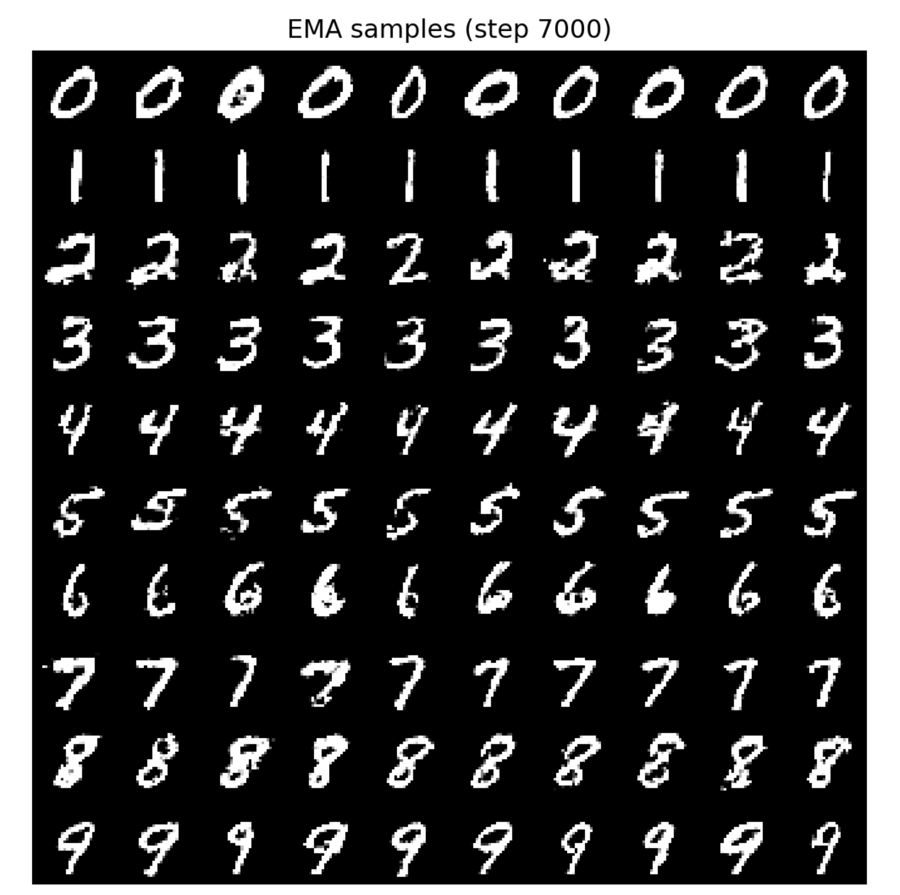

# driftax
JAX implementation of https://arxiv.org/abs/2602.04770

This repo includes:
- **1D inverse-problem / conditional inference** demos (with comparisons against other conditional density baselines).
- **MNIST DiT-style drifting model** following the authors’ training recipe (small-scale, fast-to-run example).

## Results

### 1D Inverse Problems: Conditional Inference (Comparisons)
We evaluate conditional inference on a toy inverse problem with a **multi-modal conditional** structure, and compare drifting against other common conditional approaches.

### MNIST: DiT Implementation (Author Recipe)
We implement the authors’ DiT-style generator setup for MNIST and visualize conditional samples.

---

If you use this library please cite the original authors here:

@article{deng2026drifting,
  title={Generative Modeling via Drifting},
  author={Deng, Mingyang and Li, He and Li, Tianhong and Du, Yilun and He, Kaiming},
  journal={arXiv preprint arXiv:2602.04770},
  year={2026}
}